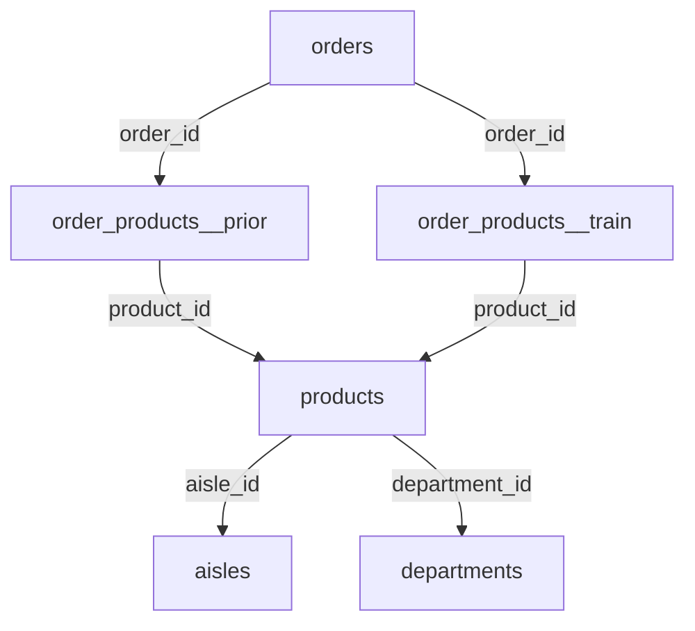

# Grocery Orders Dataset

## Overview

Imagine an online grocery-delivery service: customers open an app, fill a
"cart" with products, and place an order. A personal shopper then picks the
items in-store and delivers them. This dataset captures **~3.4 million orders**
across **6 CSV files**. Products are organised in a tidy three-level hierarchy
(product → aisle → department), and each user's order history is split into a
"prior" set (their past orders) and a "train" set (their most recent order).

**Why it teaches analytical thinking:** the data is **relational** — it's
split across linked tables, not one flat file. To answer any question you must
*join* the right tables. The classic move is climbing the hierarchy: product →
aisle → department lets you aggregate sales at three different levels of
detail. Deciding *which level answers your business question* is the skill
this dataset trains.

- **Domain:** Online grocery delivery
- **Scale:** ~3.4M orders, ~32M prior order-product rows, ~50k products
- **Task framing here:** analytics-only (EDA, segmentation, basket affinity,
  reorder loyalty) — no ML modelling

---

## The big picture: how the tables fit together

Think of a single customer's shopping history:

1. The customer places **orders** over time (`orders.csv`). Each order has a
   number (1st, 2nd, 3rd …) and a timestamp (day of week, hour).
2. Each order contains **products** (`order_products__prior.csv` for past
   orders, `order_products__train.csv` for the latest). This file records which
   products were in the cart, in what order, and whether each was a "reorder"
   (the customer had bought it before).
3. Each product belongs to an **aisle** (`aisles.csv`), and each aisle belongs
   to a **department** (`departments.csv`) — a clean three-level hierarchy.

There is **no separate customer file** — customers are identified only by
`user_id` inside `orders.csv`. Reconstructing a customer's full purchase
history is itself an analytical step.

---

## Tables at a glance

| # | File | Rows | One row = | Primary key |
|---|------|-----:|----------|------------|
| 1 | `orders.csv` | 3,421,083 | one order | `order_id` |
| 2 | `order_products__prior.csv` | ~32,000,000 | one product in a past order | `order_id` + `product_id` |
| 3 | `order_products__train.csv` | ~1,384,617 | one product in the latest order | `order_id` + `product_id` |
| 4 | `products.csv` | 49,688 | one product | `product_id` |
| 5 | `aisles.csv` | 134 | one aisle | `aisle_id` |
| 6 | `departments.csv` | 21 | one department | `department_id` |

> `order_products__prior` + `order_products__train` are mutually exclusive —
> together they cover every product ever ordered. The `orders.eval_set` column
> tells you which set each order belongs to (`prior`, `train`, or `test`).

---

## File-by-file explanation (for beginners)

### 1. `orders.csv` — the order header

**What it carries:** one row per order. This is where the "who, when, how
often" lives. It does NOT contain product details — for that you join to the
`order_products_*` files.

**Why it matters:** every analysis starts here. Want to know how often
customers reorder, what time of day is busiest, or how many orders each user
has placed? This file answers those questions.

**Columns:**
- `order_id` — unique ID of the order (the key you use to link to the
  order-products files).
- `user_id` — which customer placed the order. There's no separate customer
  table — this is the only place user identity lives.
- `eval_set` — which split this order belongs to: `prior` (past orders used as
  history), `train` (the most recent order you analyse), or `test` (held out).
- `order_number` — the sequence number for this user: 1 = their first ever
  order, 2 = their second, etc.
- `order_dow` — day of the week the order was placed (0 = Sunday … 6 = Saturday).
- `order_hour_of_day` — hour of the day (0–23).
- `days_since_prior_order` — how many days since this customer's *previous*
  order. Null for their very first order (there was no prior order).

**Example rows:**
```
order_id  user_id  eval_set  order_number  order_dow  order_hour_of_day  days_since_prior_order
2539329   1        prior     1             2          08                 (null)
2398795   1        prior     2             3          07                 15.0
```
> User 1 placed their first ever order on a Tuesday (dow=2) at 8am. Their second
  order was the next day (dow=3) at 7am, 15 days later. Notice the first order
  has no `days_since_prior_order` — it's null because there was no prior order.

---

### 2. `order_products__prior.csv` — what was bought (the history)

**What it carries:** one row per product in each *past* order. This is the
biggest file (~32 million rows!) because it records every single product in
every order in every customer's history. If an order had 8 products, there are
8 rows here.

**Why it matters:** this is your transactional backbone. To analyse "which
products are reordered most" or "what products go in the same basket", you
start here and join to `products.csv` for names and categories.

**Columns:**
- `order_id` — which order this product belongs to (links to `orders.csv`).
- `product_id` — which product was bought (links to `products.csv`).
- `add_to_cart_order` — the position in the cart: 1 = first item added, 2 =
  second, etc. Useful to study whether customers reach for staples first.
- `reordered` — 1 if this user had ordered this product in a *previous* order,
  0 if it's their first time. A key column for loyalty analysis.

**Example rows:**
```
order_id  product_id  add_to_cart_order  reordered
2         33120       1                  1
2         28985       2                  1
```
> Order 2 had at least two products. Product 33120 was added to the cart first
  and was a reorder (`reordered = 1`) — the customer had bought it before.

**Beginner tip — handling the size:** 32M rows is heavy on a normal laptop.
Two practical options:
- Read only the first N rows while exploring:
  `pd.read_csv("order_products__prior.csv", nrows=500000)`.
- Or pick a subset of users first (e.g. `user_id` 1–1000), filter `orders.csv`
  to those users, then join to get only their line items.

---

### 3. `order_products__train.csv` — what was bought (the latest order)

**What it carries:** identical structure to the prior file, but only for the
*most recent* order of each "train" user (~1.4M rows). It's the labelled set
that was used in the original competition to test reorder predictions.

**Why it matters for us:** for analytics-only work you can treat `prior` and
`train` as one combined history (concatenate them) or use `train` as a
"holdout" to compare against patterns found in `prior`. Either way, understand
that they partition the order-product rows — an order appears in one or the
other, never both.

**Columns:** same as `order_products__prior` — `order_id`, `product_id`,
`add_to_cart_order`, `reordered`.

**Example rows:**
```
order_id  product_id  add_to_cart_order  reordered
1         49302       1                  1
1         11109       2                  1
```

---

### 4. `products.csv` — the catalogue

**What it carries:** one row per product (~50,000). It links each product to
its aisle and department — the two higher levels of the category hierarchy.

**Why it matters:** this is your lookup table for product names and
categories. Without it, `order_products_*` only has numeric `product_id`s.
Join this in to turn numbers into readable names and to aggregate revenue or
reorder rates by category.

**Columns:**
- `product_id` — unique product ID (links to `order_products_*`).
- `product_name` — human-readable name, e.g. "Chocolate Sandwich Cookies".
- `aisle_id` — which aisle this product sits in (links to `aisles.csv`).
- `department_id` — which department the aisle belongs to (links to
  `departments.csv`).

**Example rows:**
```
product_id  product_name                aisle_id  department_id
1           Chocolate Sandwich Cookies   61        19
2           All-Seasons Salt             104       13
```
> Product 1 is "Chocolate Sandwich Cookies" found in aisle 61, department 19.
  To report it as " department 19: snacks" you'd join through to
  `departments.csv`.

---

### 5. `aisles.csv` — mid-level categories

**What it carries:** one row per aisle (134 rows). An aisle is a fine-grained
shelf grouping like "prepared soups salads" or "specialty cheeses".

**Why it matters:** when product-level (50k items) is too granular for a chart,
you aggregate up to aisle level (134 categories) — a manageable number for a
bar chart or heatmap.

**Columns:**
- `aisle_id` — unique aisle ID (links from `products.csv`).
- `aisle` — the aisle name.

**Example rows:**
```
aisle_id  aisle
1         prepared soups salads
2         specialty cheeses
```

---

### 6. `departments.csv` — top-level categories

**What it carries:** one row per department (just 21 rows). A department is
the coarsest grouping — "frozen", "produce", "dairy eggs", "snacks", etc.
Multiple aisles roll up into one department.

**Why it matters:** this is your highest aggregation level. A 21-bar chart of
"orders by department" is the cleanest executive summary you can make from this
dataset. Always start high-level, then drill down to aisle, then product.

**Columns:**
- `department_id` — unique department ID (links from `products.csv`).
- `department` — the department name.

**Example rows:**
```
department_id  department
1              frozen
2              other
```

---

## Entity-Relationship Diagram



---

## Join keys at a glance

| From | Field | To | Relationship |
|------|-------|----|-------------|
| `orders` | `order_id` | `order_products__prior` | 1 → many |
| `orders` | `order_id` | `order_products__train` | 1 → many |
| `order_products_*` | `product_id` | `products` | many → 1 |
| `products` | `aisle_id` | `aisles` | many → 1 |
| `products` | `department_id` | `departments` | many → 1 |

**Hierarchy:** `product` → `aisle` → `department` is a clean star-schema
snowflake — the classic teaching shape for multi-level aggregation.

> There is **no** separate `users` table. A user is identified only by
> `user_id` inside `orders`, and that user's full history is reconstructed by
> filtering `orders` on `user_id` then joining to the prior/train line items.

---

## Key analytical patterns this schema unlocks

1. **Reorder loyalty** — per `product` / `aisle` / `department`, what share of
   orders are `reordered = 1`? Rank the catalogue by stickiness.
2. **Basket affinity** — which products co-occur within the same `order_id`?
   Build co-occurrence counts by department pair (no ML needed for a
   cross-tab/cohort version).
3. **Cart-position effect** — does `add_to_cart_order` correlate with
   `reordered` and with department? (Do customers reach for produce first?)
4. **Order cadence cohort** — segment users by `days_since_prior_order`
   buckets and compare basket size (`order_number`, item counts).
5. **Time-of-day × department** — `order_hour_of_day` × `department_id`
   crosstab reveals when different categories get ordered.

---

## Known data-quality traps (teaching moments)

- **Scale:** `order_products__prior` (~32M rows) is heavy on a beginner laptop.
  Teach sampling: read with `nrows` or sample a subset of `user_id`s first.
- **Split column, not a split file:** `eval_set` in `orders` defines the
  prior/train/test partition — filter on it, never assume by file.
- **No user dimension table:** the "user" grain lives only inside `orders`;
  building a user-level summary (RFM-style) is a required intermediate step.
- `days_since_prior_order` is null for each user's first order — handle before
  any average/segmentation.
- Product/aisle/department names are clean and English-only with no locale
  field — any localised narrative (e.g. for a regional reframing) must be added
  as a presentation layer, not from the data.
